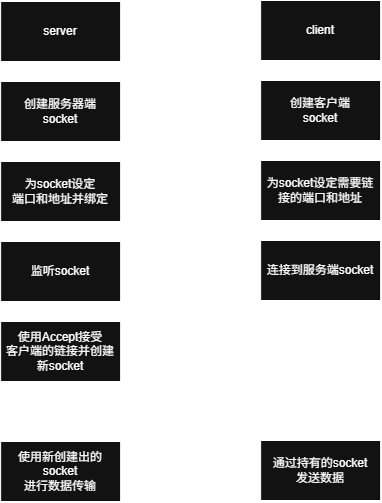

# 一个最简单的 TCP Echo Server

在 Linux 平台中，通过调用 Socket 创建一个一对一的 TCP Server，从客户端接收传入信息，并进行回显操作。

## 涉及的知识点
### socket
socket 在计算机通讯领域被称作 "套接字"，通过套接字一台计算机可以接收其他计算机的数据，也可以向其他计算机发送数据。

### 文件描述符
在 UNIX/Linux 系统中，一切都可以看作文件。为了统一对各种硬件的操作，简化接口，不同硬件设备都被看作一个文件，对这些文件的操作，等同于对磁盘上普通文件的操作。为了表示和区分已经打开的文件，UNIX/Linux 会给每个文件分配一个int类型的整数 ID，这个 ID 就被称作文件描述符(通常用 0 表示标准输入文件，用 1 表示标准输出文件)。

### socket 和 网络连接
我们可以通过 socket() 创建一个网络连接(打开一个网络文件)，其中 socket() 的返回值就是一个文件描述符。既然有了文件描述符，我们就可以像对文件操作来传递数据了。例如：read() 读取来自远端计算机中的数据，write() 向远端计算机写入数据

### 定义 socket 的传输方式
根据数据的传输方式的不同，我们需要为 socket 指定传输方式(TCP/UDP)。我们将在下文介绍这两种传输方式。

#### 流格式套接字(SOCK_STREAM)
由于采用了 TCP 协议，因此流格式套接字具有以下几个特点：
- 数据在传输过程中不会消失
- 数据是按照顺序传输的
- 数据的发送和接收是不同步的

只要不会断网， SOCK_STREAM 就可以保证数据不丢失，同时晚传送的数据不会先到达，较早传送的数据不会晚到达。流格式套接字一般适用于对数据完整性要求高的情况，例如浏览器所使用的 http 协议，如果无法保证数据准确无误，那么浏览器就无法加载 HTML。

**数据的发送和接收是不同步的**：流格式套接字的内部有一个缓冲区(字符数组)，通过socket传输的数据会保存在这个缓冲区内。接收端在接收到数据后不一定立刻读取，只要数据不超过缓冲区的容量便可。

#### 数据报格式套接字(SOCK_DGRAM)
由于采用了 UDP 协议，因此数据报套接字具有以下特点：
- 强调快速传输而非传输顺序
- 传输的数据可能丢失也可能损坏
- 限制每次传输的数据的大小
- 数据的发送和接受是同步的

数据包套接字是一种不可靠的，不按顺序传递的，以追求速度为目标的套接字。

**数据的发送和接收是同步的**：接收次应该和发送次数相同。数据包套接字一般用于需要实时性的情况，例如：微信视频聊天语音聊天等。

## 实现流程


## 代码实现
### 服务端
创建服务端socket
```cpp
#include <sys/socket.h>
int sockfd = socket(AF_INET, SOCK_STREAM, 0);
```
- 第一个参数：IP地址类型，AF_INET 表示使用 IPv4，如果是 IPv6 需要使用AF_INET6。
- 第二个参数：数据传输方式。
- 第三个参数：协议，0为自动推导协议类型(IPPROTO_TCP, TPPROTO_UDP分别表示TAP/UDP)。


初始化 sockfd 的地址空间
```cpp
#include <strings.h>
bzero(&sockfd, sizeof(sockfd));
```


设置地址结构体
```cpp
#include <arpa/inet.h>
struct sockaddr_in serv_addr;   // 在创建时使用专用地址结构方便设置地址类型
bzero(&serv_addr, sizeof(serv_addr));
```


设置地址类型, IP, Port
```cpp
serv_addr.sin_family(AF_INET);
serv_addr.sin_addr.s_addr = inet_addr("127.0.0.1");
serv_addr.sin_port = htons(8080);
```


将socket地址和服务端socket进行绑定
```cpp
// 使用通用地址结构方便用统一接口
bind(sockfd, (sockaddr*)serv_addr, sizeof(serv_addr));
```
- 第三个参数告诉 bind() 传入的地址结构的值


监听 socket 设定的端口
```cpp
listen(sockfd, SOMAXCONN);
```
第二个参数是 listen 的最大监听队列长度，使用`SOMAXCONN`代表使用系统建议的最大值128。


使用`accept`接收客户端的连接，同时创建一个用于保存客户端信息的 socket
```cpp
struct sockaddr_in clnt_addr;
socklen_t clnt_addr_len = sizeof(clnt_addr);
bzero(&clnt_addr, sizeof(clnt_addr);
/* accpet中的第三个参数用于告知地址的大小，以及返回实际地址的大小 */
int clnt_sockfd = accpet(sockfd, (sockaddr*)&clnt_addr, &clnt_addr_len);
std::cout << "new client fd: " << clnt_sockfd 
        << "! IP: " << inet_ntoa(clnt_addr.sin_addr) 
        << " Port:" << htons(clnt_addr.sin_port) << std::endl;
```
同时`accpet`是一个阻塞操作，只要没有客户端连接，就会一直呈阻塞态，无法执行下面的代码。


至此我们的测试连接服务器已经可以正常工作了，让我们写一个测试客户端来检验一下成果。

### 客户端
```cpp
int socfd = socket(AF_INET, SOCK_STREAM, 0);
struct sockaddr_in serv_addr; 
bzero(&sockfd, sizeof(sockfd));
serv_addr.sin_family = AF_INET;
serv_addr.sin_port = htons(8080)
serv_addr.sin_addr.s_addr = inet_addr("127.0.0.1");
connect(sockfd, (sockadd*)serv_addr, sizeof(serv_addr));
```


客户端通过建立的 socket 请求连接服务端的监听 socket，进而服务器会 accept 并创建一个用于 TCP 通讯的 socket。此时客户端的socket和服务端的新socket以及建立了TCP连接，之后所有的通讯均围绕在此处。


我们可以使用`Makefile`进行编译测试。

## 添加常规的错误检测

对代码可能出错的部分添加错误日志输出程序将有助于我们日常维护代码，因此我们将在`utils/util.h`下添加如下代码
```cpp
#pragam once
#include <string>

errif(bool, const std::string*);
```
以及在`utils/util.cpp`中添加具体实现代码
```cpp
errif(bool condition, const std::string *errmsg){
    if(bool){
        perror(errmsg);
        exit(EXIT_FAILURE);
    }
}
```

此操作会在程序出现问题时，进行错误消息的提示，并终止程序的进行。

对现有代码段进行更新：
### 更新后的 socket 创建部分
```cpp
int sockfd = socket(AF_INET, SOCK_STREAM, 0);
errif(sockfd == -1, "socket create error");
```

### 更新后的 bind() 部分
```cpp
errif(
    bind(sockfd, (sockaddr*)&serv_addr, sizeof(serv_addr)) == -1,
    "socket bind error"
);
```

### 更新后的 listen() 部分
```cpp
errif(
    listen(sockfd, SOMAXCONN) == -1,
    "socket listen error"
);
```

### 更新后的 connect() 部分
```cpp
errif(
    connect(sockfd, (sockaddr*)&serv_addr, sizeof(serv_addr)) == -1,现流程
![Echo]
    "socket connect error"
);
```

## 回显部分
### 实现流程


### 客户端
客户端创建定长缓冲区，并向缓冲区内写入数据
```cpp
char buf[1024];
bzero(&buf, sizeof(buf));
std::cin >> buf;
```

将数据从缓冲区写入服务端socket，并返回本次写入数据的大小，并再次清空缓冲区，准备从服务端socket读取数据
```cpp
ssize_t write_bytes = write(sockfd, buf, sizeof(buf));
if(write_bytes == -1){
    std::cout << "socket alreadly disconnected, can't write any more" << std::endl;
    break;
};
bzero(&buf, sizeof(buf));
```

从服务端socket读取数据，并返回此次读取数据的大小，同时进行判断
```cpp
ssize_t read_bytes  = read(sockfd, buf, sizeof(buf));
if(read_bytes > 0){
    std::cout << "message from server fd " << sockfd
        << ": " << buf << std::endl;
}else if(read_bytes == 0){
    std::cout << "server fd " << sockfd << " disconnected" << std::endl;
    break;
}else if(read_bytes == -1){
    close(sockfd);
    errif(
        true,
        "socket read error"
    );
}
```

在程序结束的时候记得收回文件描述符
```cpp
close(sockfd);
```

### 服务端
服务端的逻辑与客户端是相通的，只是少了写入部分
```cpp
char buf[READ_BUFFER];
while(true){
    bzero(&buf, sizeof(buf));
    ssize_t read_bytes = read(clnt_sockfd, buf, sizeof(buf));
    if(read_bytes > 0){
        std::cout << "message from client fd " << clnt_sockfd
            << ": " << buf << std::endl;
        write(clnt_sockfd, buf, sizeof(buf));
    }else if(read_bytes == 0){
        std::cout << "client fd " << clnt_sockfd << " disconnected" << std::endl;
        break;
    }else if(read_bytes == -1){
        close(clnt_sockfd);
        errif(
            true,
            "socket read error"
        );
    }
}
close(clnt_sockfd);
```

## 总结
至此，我们已经完成了一个一对一的 TCP Echo Server。完整代码示例可以在[演示示例](./src/)中进行查阅。